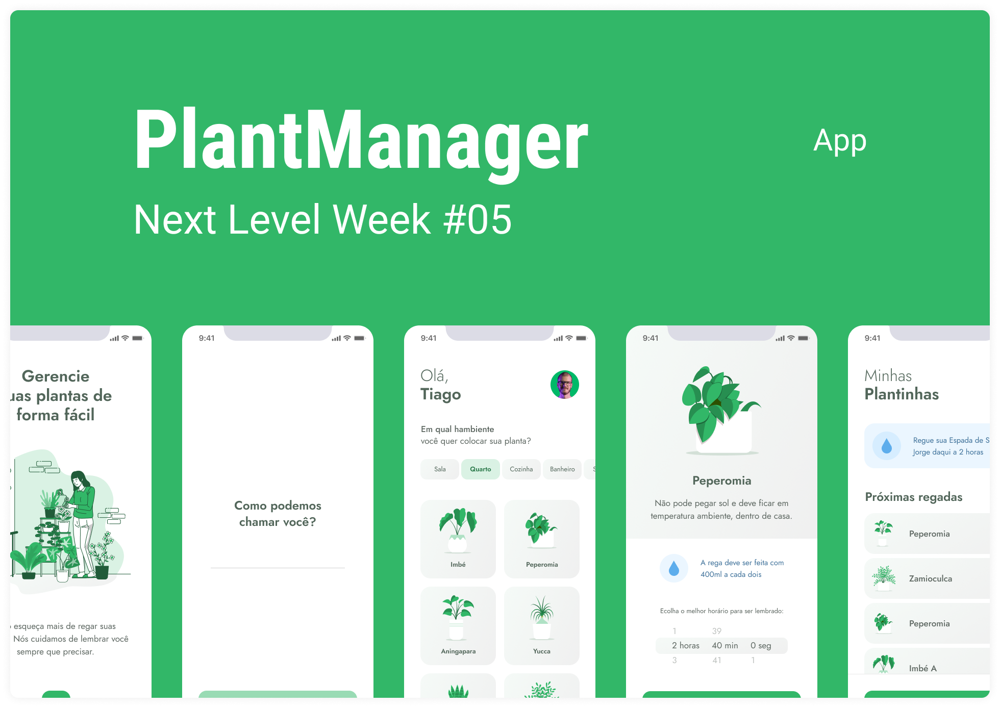

> 💡 Ferramnetas utilizadas no projeto :

<code></code>
<code></code>
<code></code>
<code></code>
<code></code>
<code></code>

<div align="center">
    
<h1>Plant Manager</h1>
</div>
<p align="center">
  

 
</p>

<h1 align="center">
  
</h1>

<br>

## 💡 Sobre o Projeto

Este projeto está sendo desenvolvido no evento Next Level Week # 05 pela [Rocketseat](https://rocketseat.com.br/) 🚀&nbsp;💜

Aplicativo para lhe ajudar a lembrar de cuidar de suas plantas de forma fácil de acordo com cada tipo de plantinha.

Você pode visualiza o layout do projeto pelo [figma](https://www.figma.com/file/IhQRtrOZdu3TrvkPYREzOy/PlantManager/duplicate).

---

## Instruções para visualizar o projeto

### Requerimentos

- [Node.js](https://nodejs.org/en/download/)
- [Expo - Play google](https://play.google.com/store/apps/details?id=host.exp.exponent)
- [Expo - App Store](https://apps.apple.com/br/app/expo-go/id982107779)

```bash
    # Clone Repository
    git clone https://github.com/AndersonAlvesCoelho/PlantManager
    cd PlantManager
```

#### 💻 Frontend

```bash
    #instale as dependências necessárias com:
    npm i ou yarn
    #agora start o projeto
    npm start ou yarn start
```

#### 📦 Server

```bash
    #Com um outro cmd aberto, starta o server no mesmo diretorio no PlantManager
    npm server ou yarn server
```
---

## 📚 Atividades realizadas

1º dia

- [x] Configuração de ambiente de desenvolvimento
- [x] Start do projeto
- [x] Splash screen
- [x] Tela de boas vindas

2º dia

- [x] Melhorar o design
- [x] Criar arquivo de estilo de fonts
- [x] Tela de indetificação de usuários
- [x] Navegação de telas com Stack Navigator

3º dia

- [x] Tela de seleção de planta
- [x] Consumir API par acarregar as plantas
- [x] Filtro de plantas por ambiente
- [x] Melhorar navegação de telas

4º dia

- [x] Validação do nome do usuário
- [x] Armazena o nome do usuário com Async Storage
- [x] Armazena a planta escolhida com Async Storage
- [x] Tela de lista d eplantas salvas

5º dia

- [x] Refatorar código
- [x] Aplicando o efeito de Swipe no componente PlantCardSecondary
- [x] Remover uma planta do Storage
- [x] A API de Notificações

---

## 📣 O que é Next Level Week?

<p> 
 O NLW (antiga onmistack) é uma semana onde a <strong>Rocketseat</strong> mostram como montar uma aplicação do zero com as melhores tecnologias do mercado.
<br>
A Rocketseat tem a consciência que a prática é a melhor aula, então sempre nos inspiram e lançam desafios para a gente se virar sozinho!
</p>
<strong>Pilhares do metódo de ensino Rocketseat</strong><br>
<li><strong>Foco: </strong> Dominar todas as linguagens e tecnologias é impossível, por isso é importante focar para ir direto ao ponto sem perder tempo.</li>
<li><strong>Grupo: </strong> A comunidade de devs é uma das melhores comunidades que existem! Trabalhar em grupo é essencial, já perdi a conta de quantas vezes ajudei e fui ajudado com erros de programação.</li>
<li><strong>Prática: </strong> E claro, não podia faltar! Quando vemos uma aula, nós podemos entender os conceitos, mas só na prática que aprendemos realmente como faze-los! </li>

<div align="center">

</div>

---

Feito por 💜&nbsp; Anderson Alves 👋 &nbsp;[linkedin](https://www.linkedin.com/in/anderson-alves-7b5587133/)
